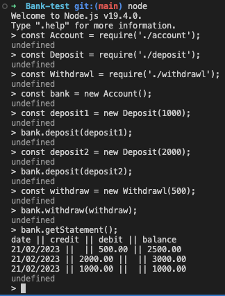

# Bank-test

This repository contains a simple banking app that allows withdrawls, deposits and printing of a statement.

These were the requirements:

- You should be able to interact with your code via a REPL like IRB or Node. (You don't need to implement a command line interface that takes input from STDIN.)
- Deposits, withdrawal.

- Account statement (date, amount, balance) printing.

- Data can be kept in memory (it doesn't need to be stored to a database or anything).

How to install?

`npm install`

how to run tests?

`jest`

Example usage in REPEL from root directory of repository:

      node
      const Account = require('./account');
      const Deposit = require('./deposit');
      const Withdrawl = require('./withdrawl');

      const bank = new Account();
      const deposit1 = new Deposit('20/02/2023', 1500);
      bank.deposit(deposit1);
      const withdraw = new Withdrawl('20/02/2023', 1000);
      bank.withdraw(withdraw);
      bank.getStatement();

Output:

